# Cluster_Swarm

## Compétences développées

### Optimisation des applications informatiques

- Mon but est de rendre disponible notre application le plus possible, tout en répartissant les charges sur les serveurs.
- Je veux répartir certains services sur certains serveurs, afin de bien visualiser d'où vient un problème avec celui-ci.
- Il est préférable de choisir quel type de serveur utiliser selon le service, afin de réduire l'impact environnemental.

### Administration des systèmes informatiques communicants

- Mon but est de déployer en production mon application.
- Au fur et à mesure de la mise en place de mon réseau de machines, j'ai amélioré mon infrastructure.
- J'ai mis en place des reverse-proxy afin d'élever la sécurité de mon infrastructure réseau.

### Gestion des données de l'information

- J'ai mis en place un service de base de donnée afin de stocker et gérer les données de mon application web.
- La connexion à la base de donnée ne peux se faire qu'en ayant les bons identifiants.
- Mise en place de logiciels de monitoring afin de visualiser les différentes interractions avec notre application.

**Création des machines :** 

Pour créer mon manager et mes 2 nodes, je clone ma VM de base, en m’assurant de choisir l’option de génération de nouvelles adresses MAC pour toutes les interfaces réseau. 

**Configuration des hôtes :** 

On peut changer le nom d’hôte de la machine au niveau du système :  *sudo hostnamectl set-hostname sari-manager* 

Ensuite on peut remplacer le 2ème hôte par le nom de celui-ci : 

Il faut faire ça sur chaque machine. 

**Configuration IP :**  

Par la suite, sur chaque machine, nous pouvons configurer l’interface principale avec la bonne adresse IP en modifiant le fichier ***/etc/network/interfaces*** :

Pour appliquer les modifications : *systemctl restart networking* 

En utilisant ***ifconfig***, nous voyons que notre interface est bien configurée : 

**Réseau NAT :** 

Nous pouvons ensuite créer dans VirtualBox le réseau NAT « ***NatBackend*** » qui va être utilisé par nos 3 machines. J’ai d’abord défini des redirections de port afin de pouvoir me connecter en **ssh** à mes machines : 

Ensuite il faut modifier le mode d’accès réseau pour que nos machines utilisent ***NatBackend*** : 

La connexion ssh fonctionne : 

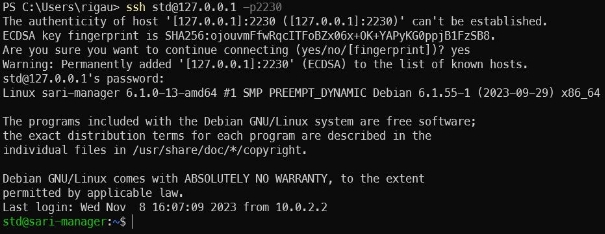

Les machines peuvent d’ailleurs communiquer entre elles, elles peuvent se ping. 

**Création du cluster SWARM :** 

Tout d’abord il nous faut initialiser le cluster **swarm** sur le manager :  

**Il faut privilégier :** *docker swarm init --advertise-addr 10.135.42.5* 

Nous pouvons récupérer la commande permettant d’ajouter des workers au cluster Swarm via cette commande : 

Nous avons juste à coller cette commande sur nos 2 nodes : 

Notre cluster Swarm est maintenant bien composé d’un manager qui est leader, et de 2 nodes qui sont des workers : 

**Installation de PORTAINER :**  

Nous avons juste à l’installer sur notre manager via ces 2 commandes : 

- *curl -L[ https://downloads.portainer.io/ce2-19/portainer-agent-stack.yml -o portainer-agent- stack.yml* ](https://downloads.portainer.io/ce2-19/portainer-agent-stack.yml%20-o%20portainer-agent-stack.yml)*
- *docker stack deploy -c portainer-agent-stack.yml portainer* 

Nous voyons bien que nous avons notre service **portainer**, ainsi que 3 **replicas** de l’**agent portainer** : 

Redirection de port :  

On peut maintenant aller sur l’adresse[ https://localhost:9443 ](https://localhost:9443/)

Si on a un **timed out** au début, nous pouvons relancer le service : *docker service update --force 7f24evngo8n9* (utiliser l’id du service portainer) 

On a bien accès à **Portainer** maintenant : 

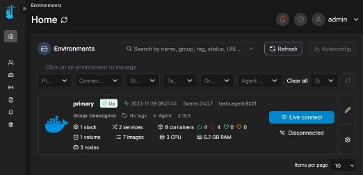

On peut visualiser notre cluster sur **Portainer**, tout va bien pour l’instant :  

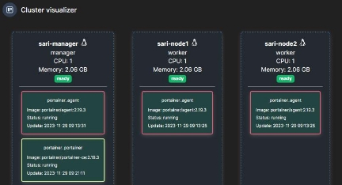

**Création du registre local :** 

Afin de stocker nos futures images **web** et **db**, de sorte que tous les nœuds aient accès celles-ci, il nous faut créer un registre local sous forme de service dans notre Swarm : 

**Création de l’image « web » :**  

Pour déployer notre application **php\_crud** (que nous avons au préalable créé sur notre manager), il nous faut définir un service web. 

Nous devons d’abord rédiger un **Dockerfile** (ici notre service utilisera **apache**) :  

Ensuite nous pouvons build notre image avec le tage « web » : 

Puis nous pouvons la push dans notre registre local (qui utilise le port 5000) : 

**Création de l’image « db » :**  

Notre application php\_crud a besoin d’une base de donnée, nous allons donc créé une image avec tous les outils nécessaires. Voici à quoi ressemble le Dockerfile : 

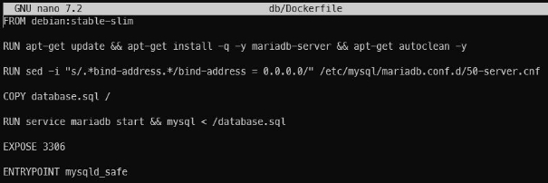

Comme pour l’image web, on build et on push notre image dans le registre : 

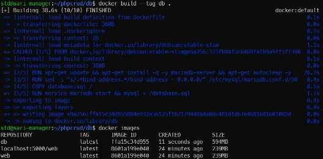

Sur les nodes worker, nous pouvons voir qu’on a bien accès à nos images via le registre local partagé : 

**Déploiement de l’application php\_crud :** 

Pour déployer notre application **php\_crud**, il nous faut créer un fichier **docker-compose.yml** à la racine de notre projet. Les services **db** et **web** utilisent les images que nous avons mises précédemment dans le registre local partagé. Voici à quoi celui-ci ressemble : 

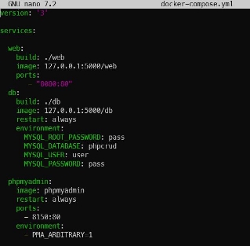

Ensuite nous pouvons build, push et déployer la stack de notre application : 

Nous voyons que tous nos services sont bien en route : 

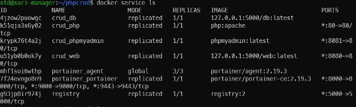

Il nous faut maintenant définir une redirection de port pour l’accès web :  

Nous pouvons maintenant accéder à notre application en ouvrant la page suivante sur un navigateur : **http://localhost :8080** 

Le site s’affiche, mais j’ai une erreur avec la fonction **mysqli\_connect()** : 

C’est cette ligne du fichier **config.php** qui pose un problème : 

J’ai décidé d’afficher la version de php dans l’index.php, afin de voir si le problème viens de là :  

L’extension **MySQLi** demande une version supérieure à **5.3.0**, utilisant la version **8.3.0** de php, le problème ne vient donc pas de là. 

En ayant relancé la satck, le message d’erreur a disparu, mais la liste des étudiants ne s’affichait pas. Le problème venait du fait que j’avais changé le mot de passe de la base de donnée dans le fichier **config.php** : 

Après avoir supprimé et redéployé la stack, notre **crud** fonctionne ! : 

**Autre problème que l’on peut rencontrer :**  

En allant sur **Portainer**, il se peut que l’on rencontre cette erreur et que l’on ne puisse plus rien faire : *Failed loading environment Unable to find an agent on any manager node* 

Il suffit de redémarrer docker sur les **nodes worker** du cluster : *sudo systemctl restart docker* Mon **Portainer** perd de temps en temps les pédales, le **dashboard** affiche n’importe quoi : 

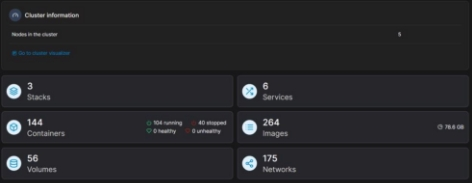

**Accès à phpMyAdmin :** 

Nous avons déjà défini le service de **phpMyAdmin** dans notre **docker-compose.yml**, il nous suffit donc d’ajouter cette redirection de port :  

On peut maintenant accéder à phpMyAdmin via l’url :[ http://localhost:8150 ](http://localhost:8150/)

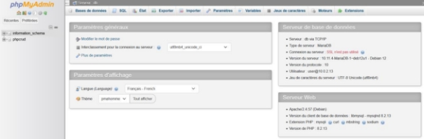

**Mise en place des reverse-proxy :**  

Il est maintenant l’heure de mettre en place nos **reverse-proxy**. 

Tout d’abord nous devons recloner notre VM de base, et la configurer. Par la suite nous pourrons cloner cette machine, nous aurons juste qu’à modifier les adresses ip là où il faut. 

Il faut configurer le nom d’hôte comme précédemment. 

Notre machine sari-rp1 devra avoir 2 interfaces réseau, l’une utilisant le réseau **NatBackend**, l’autre utilisant le réseau **NatFrontend** : 

Il faut ensuite configurer nos 2 interfaces : 

Config des interfaces :  

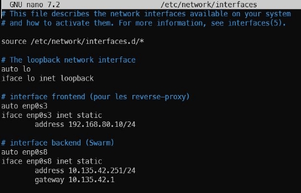

Le nom de la 2ème interface est **enp0s8** par défaut dans mon cas. Nos interfaces sont maintenant bien configurées : 

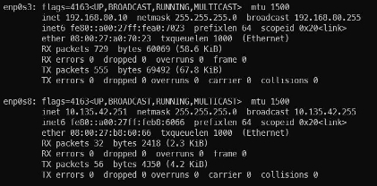

**Installation de NGINX :** 

Nous utilisons **Nginx** pour configurer notre **reverse-proxy**. Pour l’installe, il suffit de 

- *sudo apt update* 
- *sudo apt install nginx* 

J’ai voulu créer 3 fichiers de configuration différents, pour les services **web**, **pma** et **portainer**. 

J’ai ensuite créé un lien symbolique vers le dossier des sites en activité, pour chaque fichier de configuration (**sites-enables** est inclus dans le fichier **/etc/nginx/nginx.conf**) :  

Pour appliquer les modifications : *sudo systemctl reload nginx* 

Cela n’ayant pas fonctionné, j’ai décidé d’ajouter directement les 3 serveurs dans le fichier **/etc/nginx/nginx.conf :****  

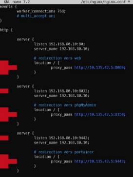

On peut appliquer les modifications : *sudo systemctl reload nginx* 

**Accès aux reverse-proxy :** 

Pour passer directement par le reverse-proxy, il faut faire notre redirection de ports sur le réseau **NatFrontend** : 

Nous pouvons en profiter pour supprimer les redirections de ports inutiles du réseau **NatBackend**. 

Nous avons maintenant accès à tous les services via le reverse-proxy : 

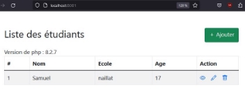

**Modification de l’application (Load-Balancing) :** 

Nous voulons répartir les charges sur nos différents serveurs, ainsi que respecter certaines contraintes, il nous faut donc modifier le **docker-compose.yml** : (ajout des réplicas et des contraintes) 

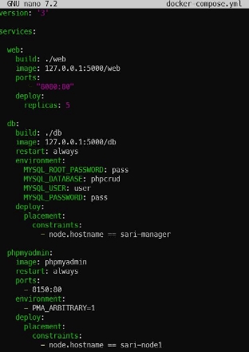

Afin de vérifier que nous tombons à chaque fois sur un serveur différent, nous pouvons afficher le nom de l’hôte sur la page d’accueil, en ajoutant ça dans l’**index.php** : 

Ensuite nous pouvons redéployer notre application : 

- *docker compose build* 
- *docker compse push* 
- *docker stack deploy -c docker-compose.yml php\_crud* 

En vérifiant sur **Portainer** on voit qu’on a bien **5 tâches web**, **phpMyAdmin** sur le **node1**, et **db** sur le manager : 

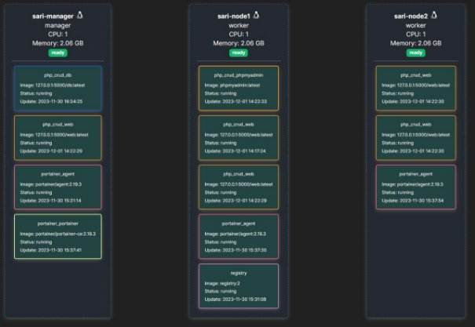

En rafraichissant plusieurs fois notre page, on remarque que le load-balancing fonctionne car le nom d’hôte change à chaque fois :  

  

**Ajout d’un logiciel de monitoring :**  

Afin d’analyser les métriques de mon applicationdéployée, j’ai décidé de mettre **Grafana** sur mon node 2, pour cela j’ai ajouté le service dans le *docker-compose.yml* :  

Pour visionner certains métriques, il nous faut utiliser un plugin type **Prometheus**, je l’ai donc également ajouté au fichier : 

Et pour le plaisir j’ai voulu tester **Loki** également : 

Il faut redéployer une nouvelle fois la stack. 

J’ai eu cette erreur : 

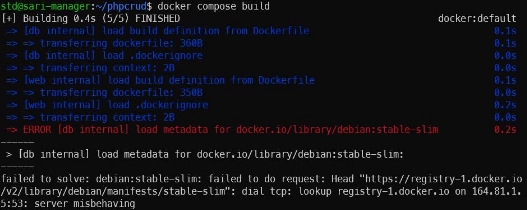

La solution : rajouter **nameserver 8.8.8.8** dans le fichier /etc/resolv.conf 

Après avoir ajouté les bonnes redirection de ports, nous avons enfin accès à Grafana et à Prometheus : 

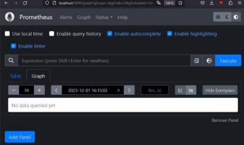

Pour visualiser les données sur **Grafana** il faut ajouter **une source de donnée Prometheus** : 

 

Il faut mettre l’ip du manager dans l’url du serveur : 

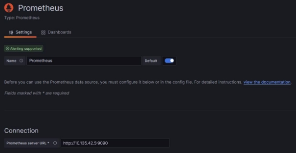

On peut ensuite utiliser notre Prometheus : (ici pour tester, le nombre total de requêtes durant les 15 dernières minutes) 

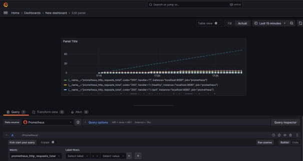

J’ai essayé de faire pareil pour **Loki**, mais je n’ai pas réussi à configurer les données à visualiser. 

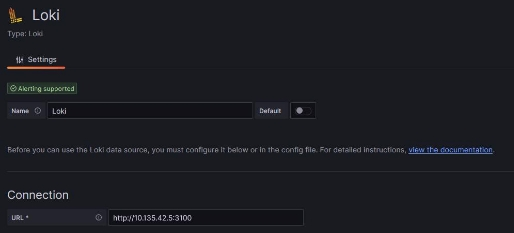

**Conclusion :** 

Maintenant je sais comment déployer une application dans un cluster Swarm, afin d’assurer la pérénité de celle-ci grâce aux contraintes,  au load-balancing ainsi qu’aux reverse-proxy. J’ai également pu voir comment utiliser Portainer et Grafana, ce qui est réellement pratique pour visualiser ce qu’il se pase dans tout ça. 
